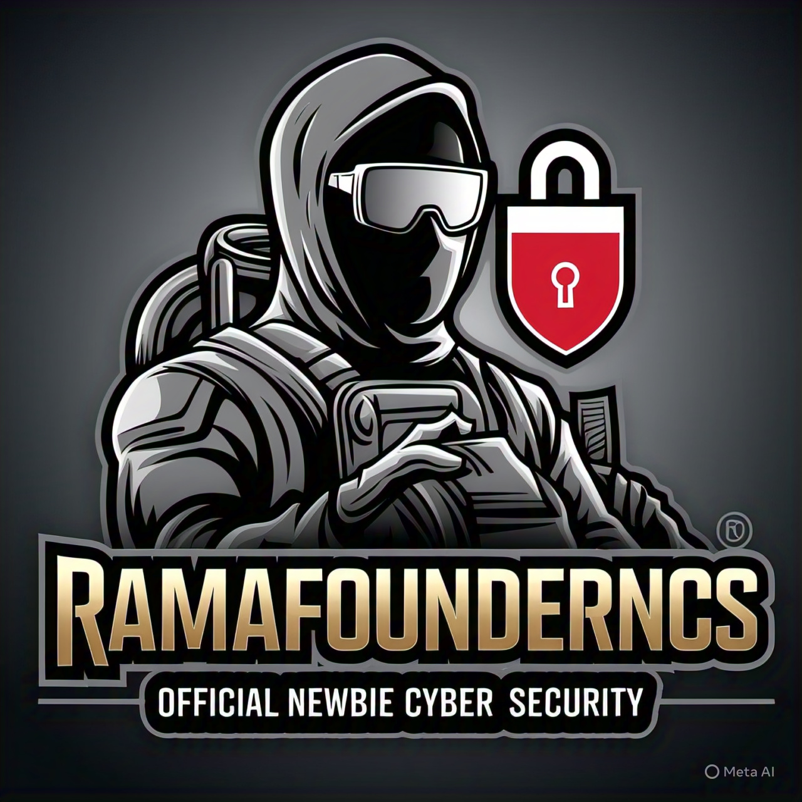

<h1 align="center">🕶️ RamaFounderNCS</h1>
<h3 align="center">FOUNDER NEWBIE CYBER SECURITY</h3>

<p align="center">
  
</p>

<p align="center">
  
  
  
  
  
</p>

---

## 🧠 Tentang Saya

> Seorang penjelajah sistem, pemburu kerentanan, dan mentor bagi pemula di dunia siber.

```yaml
alias: RamaFounderNCS
role: Hacker Profesional | Ethical Pentester | Underground Security Ops
founder: NEWBIE CYBER SECURITY
based_in: Indonesia
languages: [Python, Bash, PHP, JavaScript]
status: Active
availability: Freelance, Training, Collaboration
